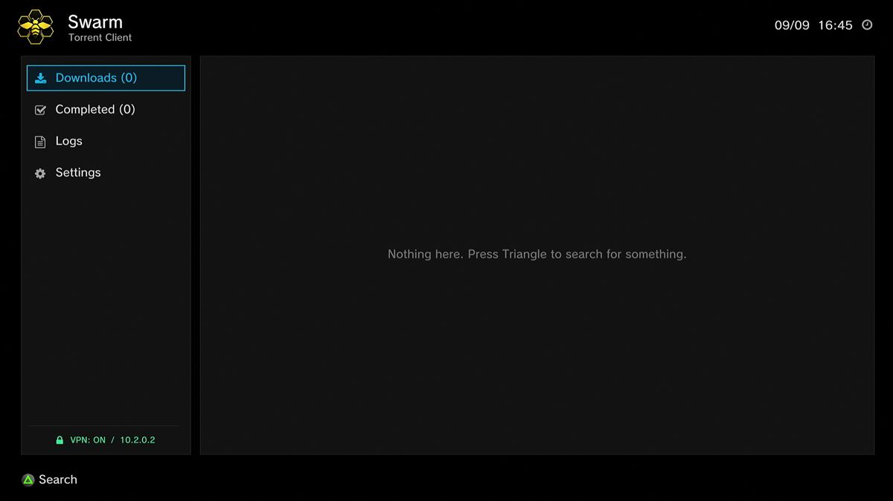
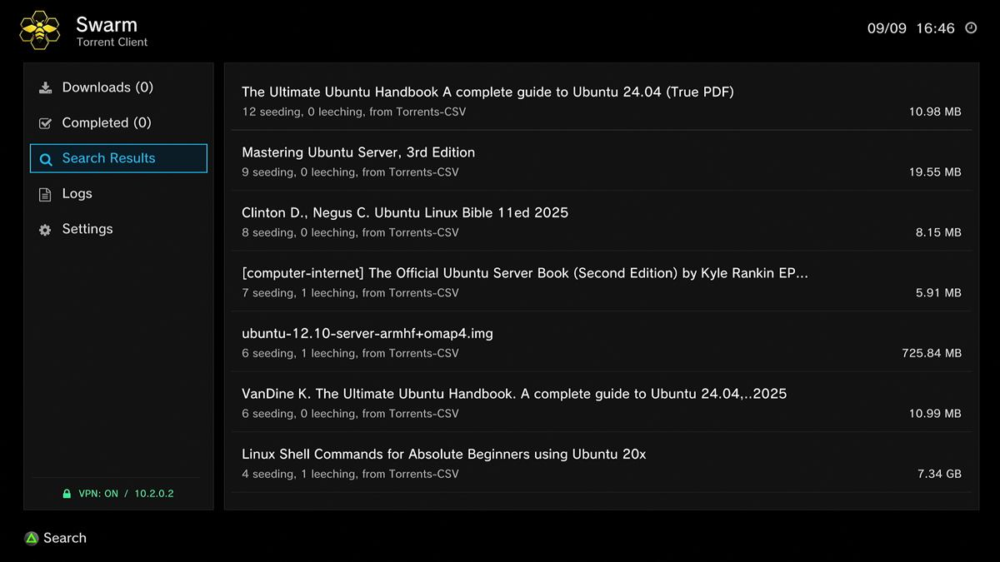
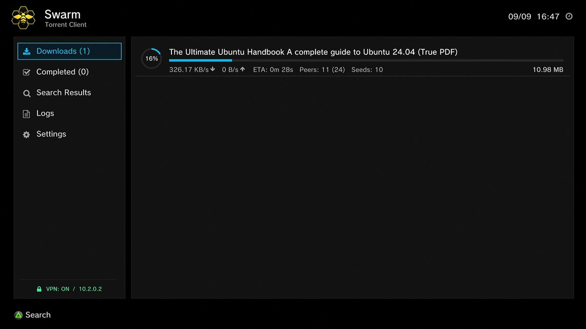
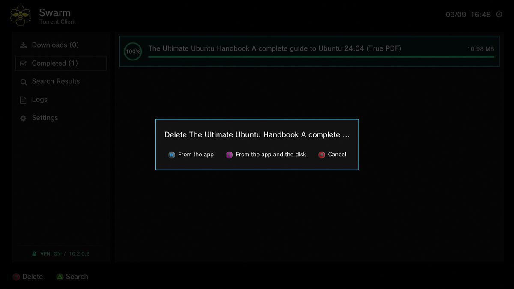
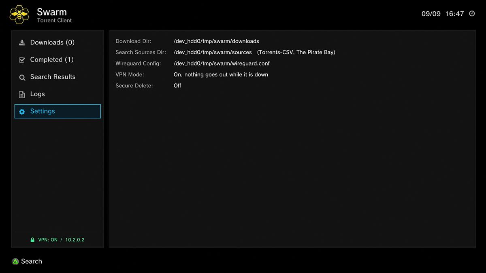

# Using Swarm

A walkthrough for someone who has just installed it. The [README](README.md) is the reference; this is
the guide. Screenshots are from a real console, during a real search and a real download.

## What it is

Swarm downloads torrents on the PS3. No PC has to stay switched on, and nothing is streamed from
anywhere else: the console talks to the other people sharing a file directly, writes the result to its
own hard disk, and shows progress on the TV.

The part that makes it unusual is the VPN. Swarm speaks WireGuard itself, inside the app, rather than
asking the console to do it. The trackers and the other peers see the VPN's address, and the console's
real address never leaves the machine. The rest of the PS3 is untouched, so the XMB, the browser and
games carry on using the ordinary connection.

Everything is set up from a few small text files, edited over FTP.

## The first launch

Start it from the Games column like any other homebrew. The first run creates `/dev_hdd0/tmp/swarm`
and fills it with a settings file, two search sites and the folders downloads go into. Nothing needs
setting up beforehand.



The line at the bottom left is worth checking every time. `VPN: ON` followed by an address means the
tunnel is up and that address is what the internet sees. The footer along the very bottom only shows
buttons that would actually do something to whatever is highlighted, so it is a reliable prompt rather
than a fixed legend.

Left and right jump between the list of views and the rows inside one. Up and down move within
whichever side has the highlight, and holding a direction walks the list rather than stepping one row
per press.

| View | What it holds |
|---|---|
| Downloads | Anything still downloading, with speed, peers and time left. |
| Completed | Everything that has finished. |
| Search Results | Appears once you have searched, and holds the last set of results. |
| Logs | The last couple of hundred lines Swarm wrote, so a stuck download can be looked at without a PC. |
| Settings | What Swarm is currently using. Read only; the file is where you change things. |

## Searching

Press Triangle anywhere. The console's on-screen keyboard comes up asking what to search for; type,
then press Start to send it. Swarm asks every search site at once and pools the answers into one list.



Every row carries the number of people seeding, who have the whole file and are sharing it, and
leeching, who are still downloading. A high seed count is the best single sign that a download will be
fast and will actually finish. The size is on the right.

The most-seeded results come first, so the top of the list is usually where you want to be. Search
again at any time with Triangle; the new results replace the old ones.

## Downloading, and where it lands

Press right to move onto the results, pick one, and press Cross. Swarm queues it and takes you to the
Downloads view.



While it runs, Square pauses or resumes whatever is highlighted and Circle deletes it. Stopping costs
nothing: the next run reads what is already on the disk, checks each piece, and asks only for the parts
that are missing, so a download interrupted by a power cut picks up where it left off.

Everything lives under `/dev_hdd0/tmp/swarm`, outside the game folder, because installing the app wipes
that.

| Folder | What is in it |
|---|---|
| `downloads/` | Finished content. This is what you copy off over FTP. |
| `downloads/incomplete/` | Anything still downloading, already in the shape it will have when done. |
| `downloads/resume/` | One small file per torrent, holding the link it came from, so the list survives a restart. |

A part-finished download stays in `incomplete` and moves up into `downloads` only once every piece is
in, so a folder of content is never half a download.

> **Known issue, 9 September 2026.** That final move currently fails. The log says `a finished torrent
> could not be moved out of incomplete` and the finished file stays in `downloads/incomplete`. The file
> itself is complete and usable, so until this is fixed, look in `incomplete` as well as `downloads`.

### Deleting



Deleting always asks first. **From the app** takes the row off the list and leaves the file on the disk.
**From the app and the disk** removes both. Circle again cancels.

## Adding a VPN

You need a WireGuard configuration file from a VPN provider. It is the same file their desktop or phone
app uses, with an `[Interface]` section and a `[Peer]` section. Most providers have a "download config"
or "manual setup" page that hands you one.

1. Download the `.conf` from your provider. Any of their servers will do; a nearby one is usually faster.
2. Open it and check the `Endpoint` line is an address, not a name. Swarm cannot yet look up names, so
   if yours reads `Endpoint = de-1.provider.net:51820`, look that name up on a PC and put the address in
   its place.
3. Copy it over FTP to `/dev_hdd0/tmp/swarm/wireguard.conf`. Nothing points at it, so the name and the
   place are what make it work.
4. Start Swarm and read the line at the bottom left. `VPN: ON` with an address means it worked.

```
[Interface]
PrivateKey = <your private key>
Address    = 10.2.0.2/32

[Peer]
PublicKey  = <the server's public key>
AllowedIPs = 0.0.0.0/0
Endpoint   = 185.65.135.72:51820   # an address, not a name
```

The private key is the whole of your VPN account: anyone who reads the file can use it. Swarm never
writes any part of it to the log, and on the normal logging setting it does not record which server it
connected to either.

### The three ways it can run

Both settings are in `settings.txt`.

| `vpn` | `killswitch` | What happens |
|---|---|---|
| `off` | ignored | Everything goes over the console's own connection. The sidebar reads OFF / NOT PROTECTED. |
| `on` | `off` | The tunnel is used when it is up. If it cannot start, the console's own connection is used instead and the sidebar says so. The forgiving setting. |
| `on` | `on` | Nothing reaches the network at all unless the tunnel is up. The sidebar reads NET BLOCKED and searching is refused. The safe setting, and the default. |

A typo in either setting leaves the protection on rather than off: only the exact word `off` turns
something off.

## Adding your own search sites

A site Swarm can search is one text file in `/dev_hdd0/tmp/swarm/sources`. Copy a file in to add a site,
delete it to remove one, or move it into `sources/disabled` to keep it without using it. They are read
when the app starts.

Two come with it, Torrents-CSV and The Pirate Bay. Both answer a search with data rather than a page,
which is the requirement.

```
name    = My Site
search  = https://example.org/api/q?q={query}
format  = json
list    = torrents         # the part of the answer holding the list
title   = name             # which field is the title
hash    = infohash
size    = size_bytes
seeds   = seeders
peers   = leechers
tracker = udp://tracker.opentrackr.org:1337/announce
tracker = udp://open.stealth.si:80/announce
```

| Line | What it means |
|---|---|
| `name` | What the results say they came from. The file's own name is used if you leave it out. |
| `search` | The address to fetch, with `{query}` where the typed words go. Required: a file without it is skipped, because a site that cannot be given words to look for could only ever show the same few newest torrents. |
| `format` | `json` or `rss`. A file asking for anything else is skipped rather than guessed at. |
| `list`, `title`, `hash`, `size`, `seeds`, `peers` | For a `json` site, which field in the answer holds what. Feeds have settled names for these already, so they can be left out. |
| `torrent` | Where the torrent file itself lives, with `{hash}` filled in from the results. Leave it out when the results already link straight at the file. |
| `tracker` | May be repeated, up to four. A site that gives a hash and no file needs these, because a link built from a bare hash has nowhere to ask for peers. Use the trackers the site itself names. |
| `category`, `adultcategories` | Which field holds the number the site files a torrent under, and the run of those numbers that means pornography, so it can be left out of results. For example `500-599`. |

To find the address for `search`, search the site in a browser on a PC and look for an API, a JSON
address or an RSS feed. Fetch it once in the browser to confirm it answers with data rather than a page,
then replace the words you searched for with `{query}`. The two shipped files are working examples of
the JSON kind, and the Settings view lists the sites it managed to load, which is the quickest way to
confirm a new file was read.

Two kinds of site will not work. One that only answers a real browser returns an error even on its feed
address. One with no feed or API at all would need its pages read, which is deliberately not supported:
the markup changes constantly and a text file cannot follow it.

## Settings

The Settings view shows what Swarm is currently using. It cannot be edited there.



`/dev_hdd0/tmp/swarm/settings.txt` is created with documented defaults on first launch. Edit it over
FTP; changes apply the next time the app starts.

| Key | Default | What it does |
|---|---|---|
| `vpn` | `on` | Whether Swarm's traffic goes through the tunnel. |
| `killswitch` | `on` | With the VPN on, whether anything may go out while the tunnel is down. |
| `securedelete` | `off` | Whether deleting content from the disk writes over it first. |
| `logs` | `normal` | `full` also records what is being downloaded and searched for, and every peer and packet. |

### Secure delete

Ordinary deleting removes the file's name and leaves its contents on the disk until something else
happens to write over them, which is why recovery tools work. With `securedelete=on`, every byte is
written over first, so there is nothing left to recover.

It costs the time of writing the file again. Measured on the console's own disk: 32 MB took 1303 ms
against 2 ms for an ordinary delete, so about 25 MB/s. A 1.5 GB film is roughly a minute. That is why it
is off by default.

### What goes in the log

On `normal`, the log records that Swarm started, which build it is, whether the VPN came up, what the
settings are, anything that went wrong, and a line when a download finishes. It never says what was
downloaded, what was searched for, which trackers or peers were talked to, or which VPN server was used.

`logs=full` names torrents and search terms, and the log file sits in a folder the FTP plugin serves to
the local network. Turn it on to work out why something is broken, then turn it back off.

## When something is wrong

**The sidebar says NET BLOCKED and searching is refused.** The tunnel did not come up and the kill
switch is doing its job. Check the `Endpoint` line in `wireguard.conf` is an address rather than a name,
and that both keys were copied whole. The Logs view will say more.

**A search returns nothing at all.** Check the Settings view lists the site you expected. If it is
missing, the file is either in the `disabled` folder, or has no `search` line, or asks for a `format`
that is not `json` or `rss`.

**A download sits at nothing with no peers.** Usually the torrent itself, so check the seed count on the
result first. A well-seeded one that still does nothing points at the trackers, so make sure the source
file names trackers the site actually uses.

**Everything is gone after reinstalling the app.** It should not be. Installing wipes the game folder,
which is why nothing Swarm cares about lives there. If `/dev_hdd0/tmp/swarm` is empty, something else
removed it.
